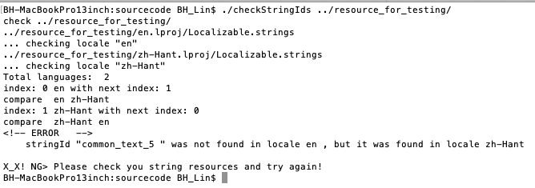
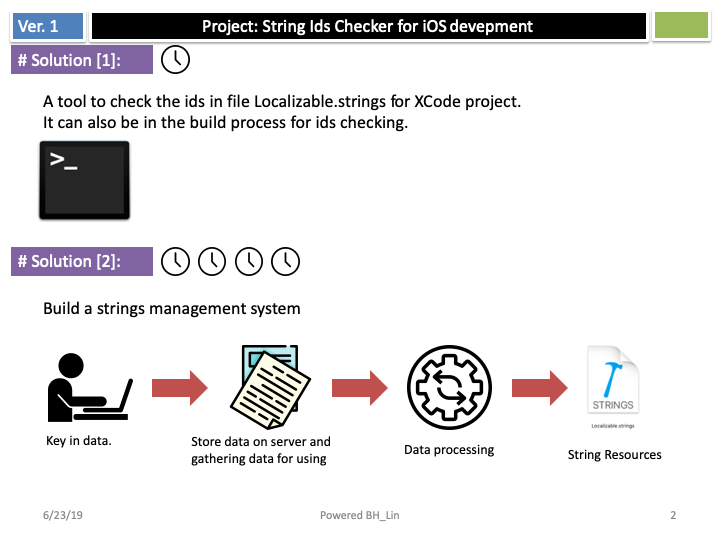
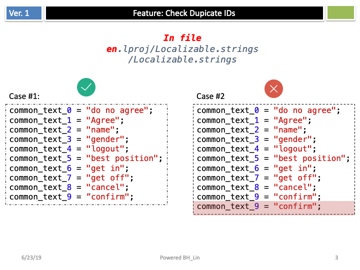
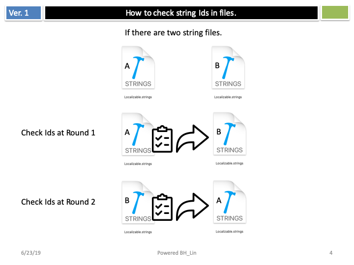

# StringIdsChecker
  

it's a tool to check the ids in file Localizable.strings for XCode project.

## How to use it.
<code>  
	./checkStringIds ./checkStringIds ../resource_for_testing/  
</code>  
  
## Concept
  
  
  

