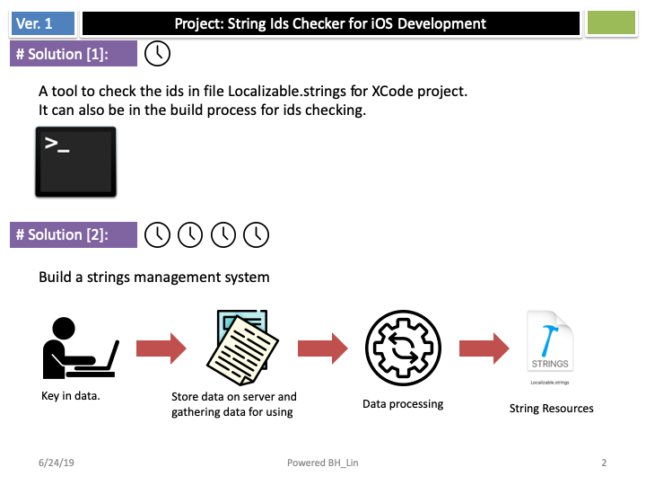
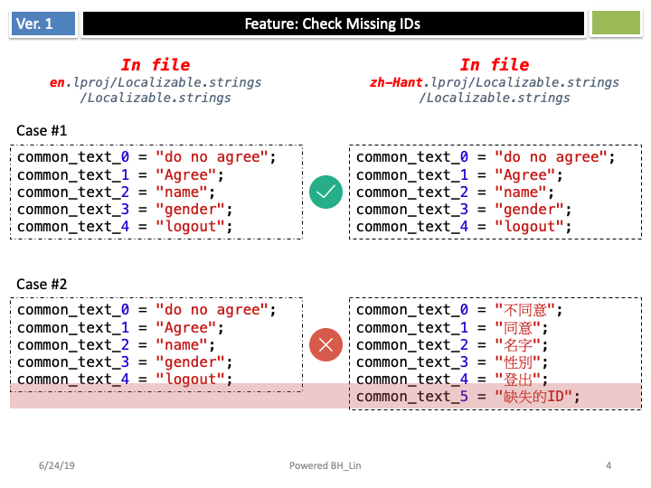

# StringIdsChecker
  

it's a tool to check the ids in file Localizable.strings for XCode project.

## Concept
  
  
  
  

## How to use it.
<code>./checkStringIds ../resource_for_testing/</code>
  